# PHP MODULAR

### Buat file baru dengan nama **header.php**

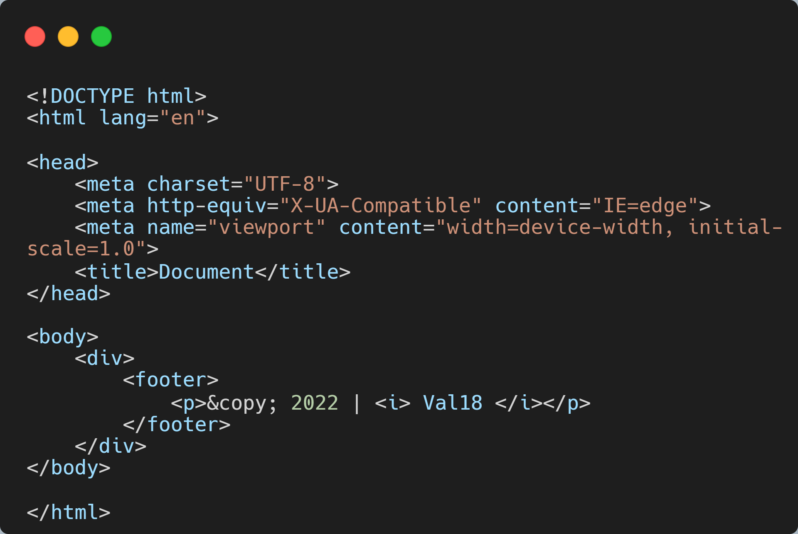

### Buat file baru dengan nama **footer.php**

### Buat file baru dengan nama **home.php**

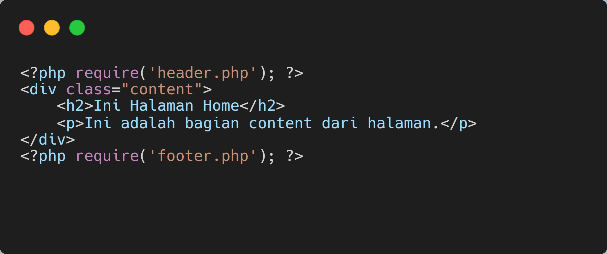

### Buat file baru dengan nama **about.php**

### Buka melalui browser 

http://localhost/lab9_php_modular/

**Home**

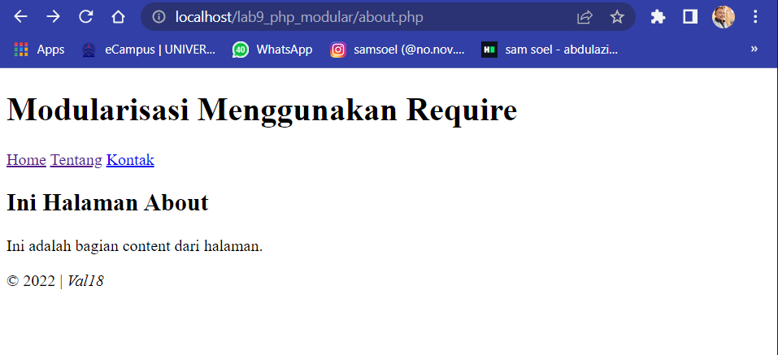

**About**

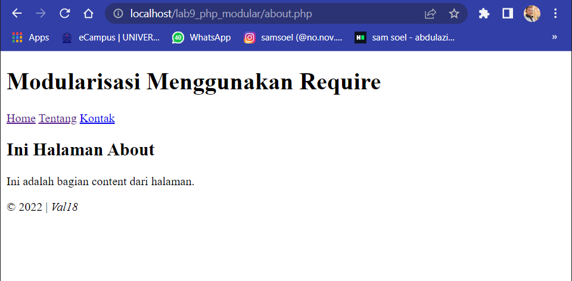

## Pertanyaan dan Tugas 

Implementasikan konsep modularisasi pada kode pemograman praktikum 8 tentang data base, sehingga setiap halamannya memiliki tamplate tampilan yang sama.

## Directory 

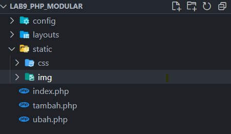

## Config

**koneksi.php**

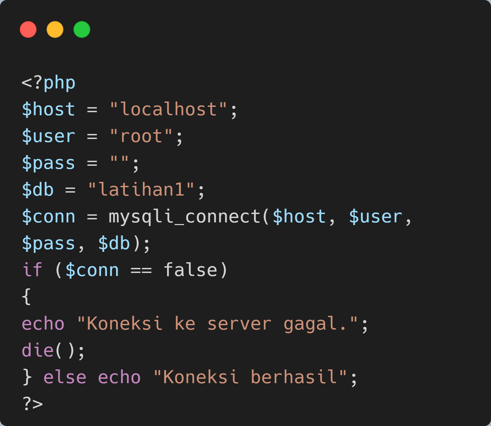

**tambah.php**

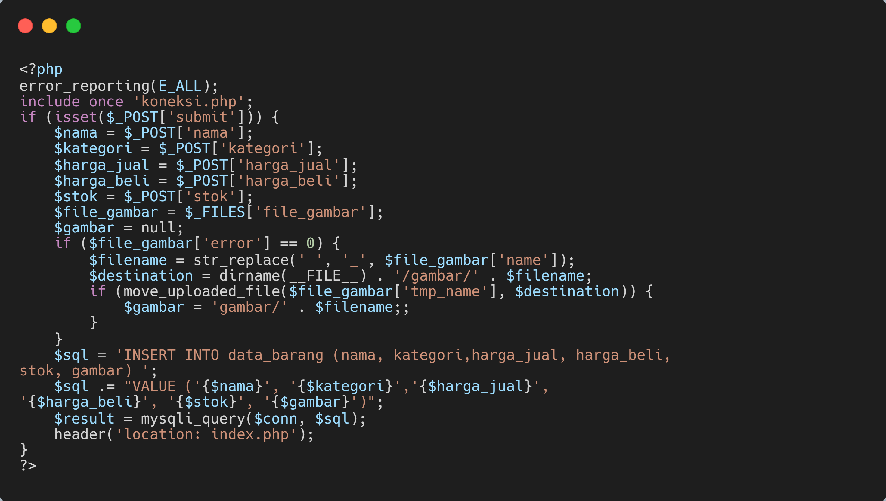

**ubah.php**

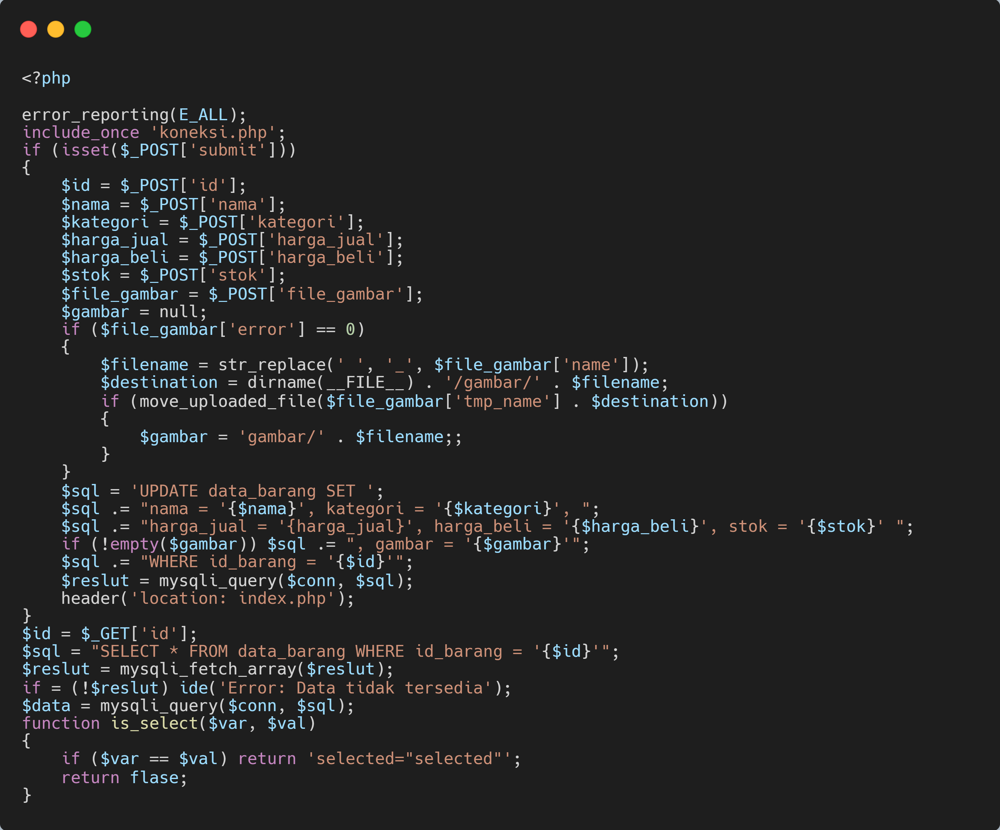

**hapus.php**

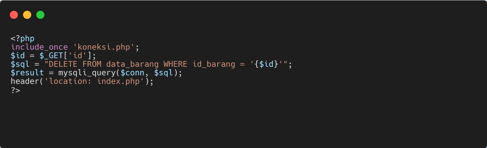

## layout

**head-static.php**
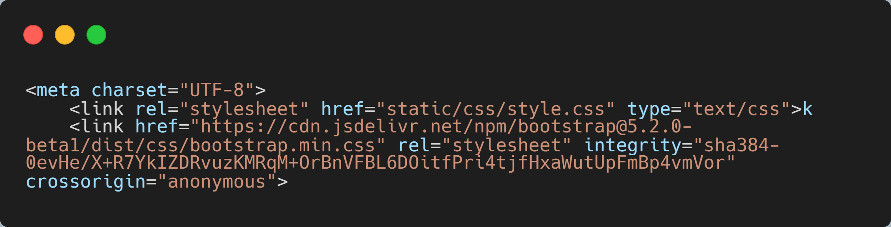

**header.php**

**main.php**

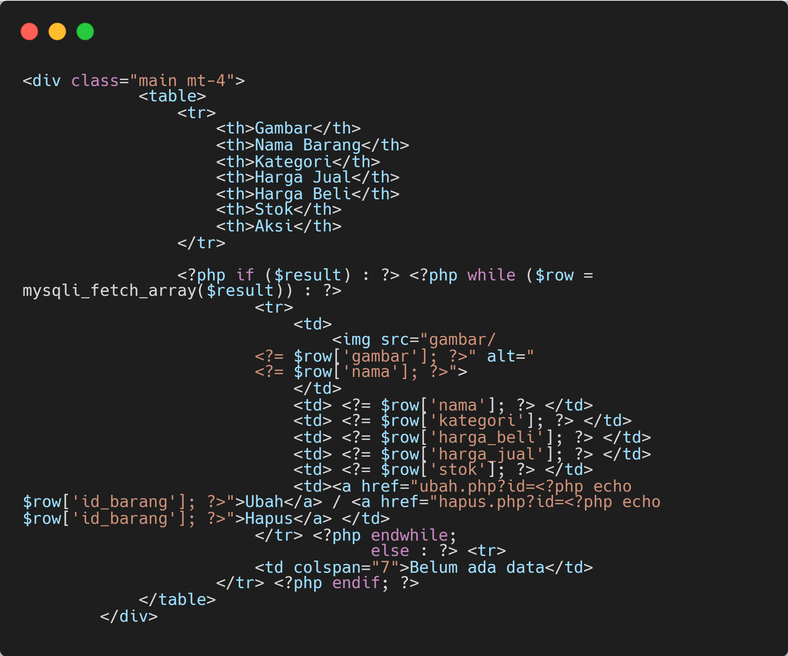

**footer.php**

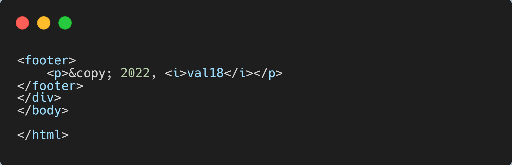

## Static

**style.css**

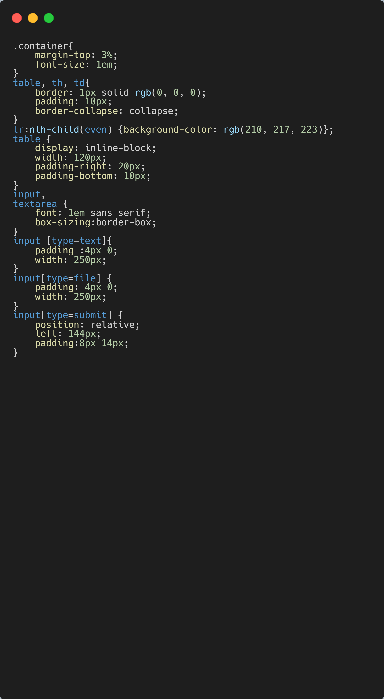

## Sub-file

**index.php**

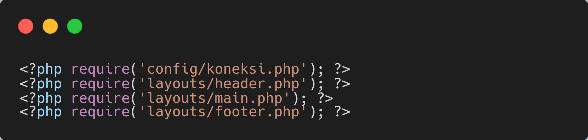

**tambah.php**

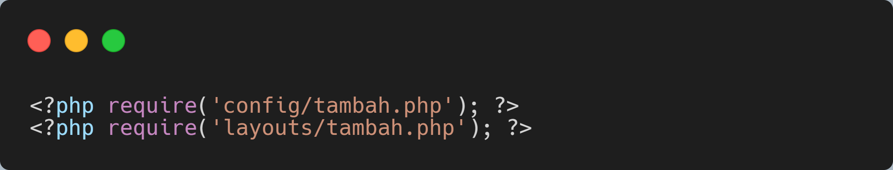

**ubah.php**

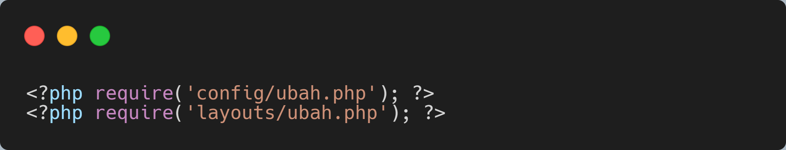